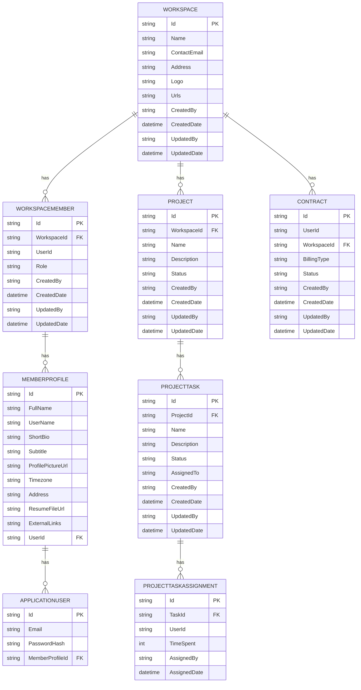

```mermaid
erDiagram
    WORKSPACE {
        string Id PK
        string Name
        string ContactEmail
        string Address
        string Logo
        string Urls
        string CreatedBy
        datetime CreatedDate
        string UpdatedBy
        datetime UpdatedDate
    }

    WORKSPACEMEMBER {
        string Id PK
        string WorkspaceId FK
        string UserId
        string Role
        string CreatedBy
        datetime CreatedDate
        string UpdatedBy
        datetime UpdatedDate
    }

    PROJECT {
        string Id PK
        string WorkspaceId FK
        string Name
        string Description
        string Status
        string CreatedBy
        datetime CreatedDate
        string UpdatedBy
        datetime UpdatedDate
    }

    PROJECTTASK {
        string Id PK
        string ProjectId FK
        string Name
        string Description
        string Status
        string AssignedTo
        string CreatedBy
        datetime CreatedDate
        string UpdatedBy
        datetime UpdatedDate
    }

    PROJECTTASKASSIGNMENT {
        string Id PK
        string TaskId FK
        string UserId
        int TimeSpent
        string AssignedBy
        datetime AssignedDate
    }

    CONTRACT {
        string Id PK
        string UserId
        string WorkspaceId FK
        string BillingType
        string Status
        string CreatedBy
        datetime CreatedDate
        string UpdatedBy
        datetime UpdatedDate
    }

    MEMBERPROFILE {
        string Id PK
        string FullName
        string UserName
        string ShortBio
        string Subtitle
        string ProfilePictureUrl
        string Timezone
        string Address
        string ResumeFileUrl
        string ExternalLinks
        string UserId FK
    }

    APPLICATIONUSER {
        string Id PK
        string Email
        string PasswordHash
        string MemberProfileId FK
    }

    WORKSPACE ||--o{ WORKSPACEMEMBER : has
    WORKSPACE ||--o{ PROJECT : has
    PROJECT ||--o{ PROJECTTASK : has
    PROJECTTASK ||--o{ PROJECTTASKASSIGNMENT : has
    WORKSPACE ||--o{ CONTRACT : has
    WORKSPACEMEMBER ||--o{ MEMBERPROFILE : has
    MEMBERPROFILE ||--o{ APPLICATIONUSER : has

```